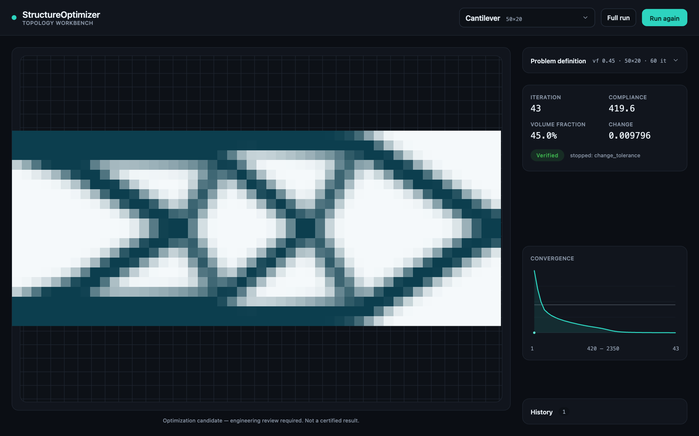

# StructureOptimizer

本地、依赖极轻的 2D/2.5D SIMP 拓扑优化工具 —— 一个 numpy-only 的柔度最小化引擎，
前面套了一个体验级 web 工作台：在浏览器里实时看着设计收敛、验证它、导出几何。

> 这是一个**作品集项目，不是已上线的产品**。引擎和工作台是真实可达的；底下还压着
> 一层旧的研究代码则不是。诚实的范围拆解见 [范围与状态](#范围与状态)。

## 演示

工作台界面（一个跑完并验证通过的 cantilever 候选）：左侧视口是收敛后的密度场，右栏自上而下
是问题定义、实时指标、`Verified` 验证徽章、收敛曲线、历史记录：



引擎在优化过程中输出的密度场收敛动画。工作台视口实时流式渲染的是同一份密度场、同一套配色
—— 这段 GIF 就是上图"实时看收敛"那一步逐迭代的样子：


## 它能做什么

工作台是主入口，流程如下：

1. **选 benchmark** —— 从内置问题里挑一个（`GET /api/benchmarks`）。
2. **调问题** —— 在浏览器里改 run config。上限在**服务端**强制（超限的配置直接
   HTTP 400 拒绝），客户端镜像同一套上限，在请求发出前就拦住非法的 Run。
3. **实时看收敛** —— 每次迭代的密度帧 + 指标通过 WebSocket 流式推送到 canvas 密度
   视口和一个手写的 SVG 收敛曲线，引擎一边算一边出图。
4. **验证** —— run 结束后，独立验证结果和最终 summary、密度一起呈现。
5. **导出 / 对比** —— 把最终设计导出为 SVG / DXF / STL（导出文件内嵌 provenance/
   免责声明 —— SVG 里是 XML 注释，DXF 里是 `999` group code），或打开两个 run 的
   并排对比弹窗。历史 run 会列出来、可重新打开。

同一个 numpy 引擎也有 CLI（`structure-optimizer`，入口在 `pyproject.toml`），含
`run / verify / report / demo / export / study` 六个子命令。一次 `run` 会落一份
自包含的记录：`input.json`、`density.npy`、`metrics.csv`、`summary.json`、
`verification.json`、`manufacturability.json`、`report.md`，外加若干 PNG 和一个
优化过程 GIF。

## 架构

三层，一个引擎：

- **引擎**（`structure_optimizer/`）—— SIMP 柔度最小化，optimality-criteria 更新，
  **纯 numpy**（默认路径不依赖 scipy/matplotlib；PNG/GIF 用纯 numpy + zlib 写出）。
  CLI 和工作台驱动的是同一份代码。
- **后端**（`server/`，可选 `[web]` extra = fastapi + uvicorn）—— 一个 worker 线程
  跑同步引擎，`on_iteration` 回调把每次迭代的帧推进线程安全的 `queue.Queue`，一个
  async 任务把队列排到 WebSocket。`RunManager` 在内存里保留最近 16 个 run。端点：
  `GET /api/benchmarks`、`GET /api/benchmarks/{id}/config`、`POST /api/runs`、
  `GET /api/runs`、`GET /api/runs/{id}`、`WS /api/runs/{id}/stream`、
  `GET /api/runs/{id}/export`、`GET /api/health`。
- **前端**（`web/`）—— React 18 + TypeScript（strict）+ Vite。CSS design-token 系统
  （`web/src/theme/tokens.css`）是样式的唯一真相源 —— 只用 token，不引图表库（收敛
  曲线是手写 SVG），密度视口用 canvas。

**流式接缝。** 为工作台对引擎做的**唯一**改动，是 `core/simp.py` 里一个可选、默认关闭
的 `on_iteration` 回调。默认值（`None`）下 CLI 和测试路径与改动前 byte-identical ——
可复现性不受影响。正是这个回调让 worker 线程能在不分叉优化主循环的前提下吐出实时帧。

## 运行

两个服务（后端 `:8000`，Vite 开发服务器 `:5173`，后者把 `/api` 代理过去）。确切的
安装和启动命令在 **[`web/README.md`](web/README.md)** —— 不在这里重复，保持单一真相源。

## 验证

```bash
python -m pytest                       # 引擎测试套件
python -m server._smoke                # 进程内 REST + WebSocket 端到端检查（无需浏览器）
cd web && npm run build                # tsc --noEmit + Vite 生产构建
```

## 范围与状态

作品集项目，对"什么是真的、什么不是"如实说明：

- **引擎 —— 真实。** SIMP 引擎、它的 CLI、run store、独立验证都是可达的、有测试的、
  被内置 benchmark 实际跑过的。
- **工作台 —— 真实，里程碑 M1–M4。** 实时收敛视口（M1）、SVG/DXF/STL 几何导出（M2）、
  浏览器内问题定义编辑器 + 服务端上限强制（M3）、历史记录 + 重新打开（M4），外加导出
  provenance/免责声明、两个 run 的并排对比。可靠性定位是**单机单用户、单个进行中的
  run**。
- **`structure_optimizer/core/` 的 v6–v16 模块 —— 探索性，不是产品功能。** ~54 个 core
  模块里大约 30 个是旧"wave"迭代留下的实验性研究代码（higher-smoothness Korobov /
  fast-CBC 拟蒙特卡洛、copula 可靠性、KKT 影子价格等）。它们**从 CLI、workflow、
  benchmark 都不可达**（零引用），**不属于**这个能用的工具。它们作为研究产物保留、
  作为债务记录在案 —— 完整且坦诚的说明见
  **[`docs/ASSESSMENT-2026-05-29.md`](docs/ASSESSMENT-2026-05-29.md)**。

`docs/` 目录里还有一长串历史 `blueprint-vN` / `quality-rubric-vN` 文件，来自那段迭代。
它们为存档保留，但不是了解本项目的入口 —— 上面那份 assessment 才是。

## 许可证

见 [LICENSE](LICENSE)。
